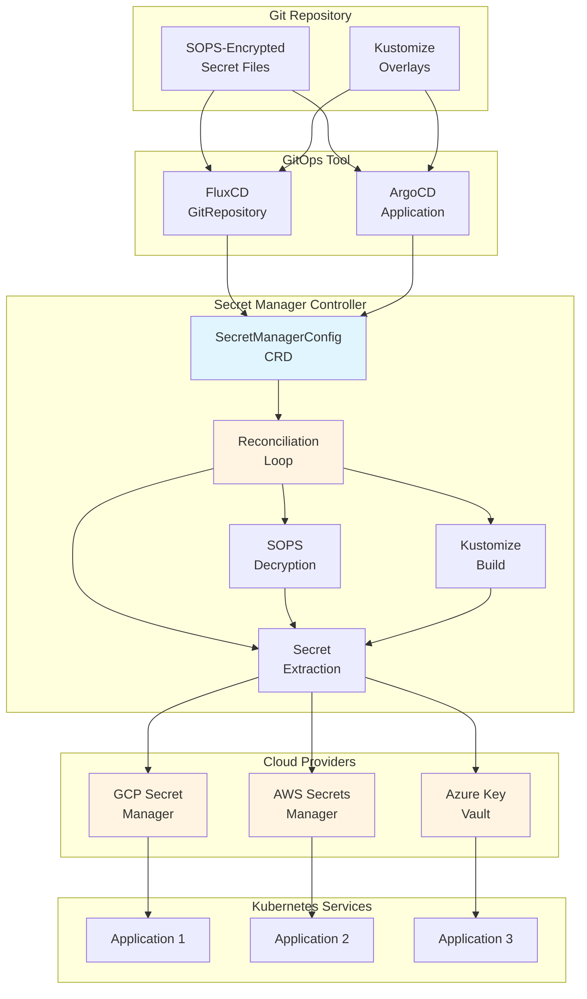
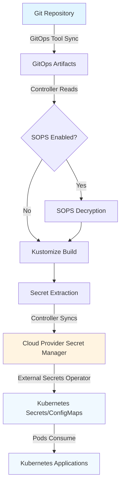
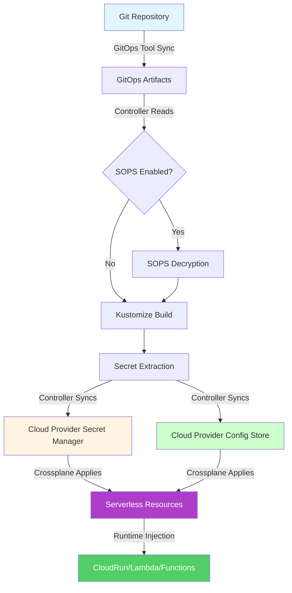

# Architecture Overview

The Secret Manager Controller is a Kubernetes operator that syncs secrets from GitOps repositories to cloud secret management systems.

## High-Level Architecture

## Core Concepts

### 1. GitOps-Driven

The controller follows GitOps principles:
- **Git is the source of truth** for all secrets
- Secrets are version-controlled and auditable
- Changes flow from Git → Controller → Cloud Provider
- No manual secret management in cloud providers

### 2. GitOps-Agnostic

Works with any GitOps tool:
- **FluxCD**: Uses `GitRepository` CRD and source-controller artifacts
- **ArgoCD**: Uses `Application` CRD and direct Git access
- **Others**: Can be extended to support additional tools

### 3. Multi-Cloud Support

Supports all major cloud providers:
- **GCP Secret Manager**: Native integration for GKE
- **AWS Secrets Manager**: Native integration for EKS
- **Azure Key Vault**: Native integration for AKS

### 4. SOPS Integration

Automatically decrypts SOPS-encrypted secrets:
- Uses GPG keys stored in Kubernetes Secrets
- Supports both file-level and value-level encryption
- Maintains security while enabling Git storage

## Workflow

### 1. Git Repository Setup

Secrets are stored in Git repositories:
- Organized by service and environment
- Encrypted with SOPS (optional but recommended)
- Managed via Kustomize overlays

### 2. GitOps Tool Sync

GitOps tool (FluxCD/ArgoCD) syncs repository:
- FluxCD: Creates artifacts in `/tmp/flux-source-*`
- ArgoCD: Clones repository directly
- Controller watches for updates

### 3. Controller Reconciliation

Controller reconciles secrets:
1. **Reads** GitRepository/Application artifacts
2. **Decrypts** SOPS-encrypted files (if enabled)
3. **Builds** Kustomize overlays
4. **Extracts** Kubernetes Secret resources
5. **Syncs** to cloud provider secret manager

### 4. Cloud Provider Sync

Secrets are synced to cloud provider:
- GCP: Stored in Secret Manager
- AWS: Stored in Secrets Manager
- Azure: Stored in Key Vault

### 5. Service Consumption

**Kubernetes Workloads:**
- External Secrets Operator syncs to ConfigMaps/Secrets
- Pods consume via volume mounts or environment variables
- No knowledge of GitOps or SOPS

**Serverless Workloads:**
- Crossplane provisions serverless resources
- Secrets injected via `secretKeyRef` (CloudRun) or Lambda Extensions
- Configs accessed via SDKs or environment variables
- No knowledge of GitOps or SOPS

## Key Components

### SecretManagerConfig CRD

The main configuration resource:
- Defines source (GitRepository/Application)
- Configures provider (GCP/AWS/Azure)
- Specifies secret paths and options

### Reconciliation Loop

Core controller logic:
- Watches SecretManagerConfig resources
- Polls GitOps artifacts for changes
- Syncs secrets to cloud providers
- Updates status and conditions

### SOPS Decryption

Handles encrypted secrets:
- Reads GPG keys from Kubernetes Secrets
- Decrypts SOPS-encrypted files
- Supports multiple encryption methods

### Kustomize Builder

Processes Kustomize overlays:
- Runs `kustomize build` on specified paths
- Extracts Kubernetes Secret resources
- Handles overlays, patches, and generators

### Provider Clients

Cloud provider integrations:
- GCP Secret Manager client
- AWS Secrets Manager client
- Azure Key Vault client
- All support Workload Identity/IRSA

## Data Flow

### Kubernetes Workloads

### Serverless Workloads

See [Serverless Integration](./serverless-integration.md) for complete serverless architecture details.

## Security Model

### Authentication

- **Workload Identity** (GCP/Azure): No stored credentials
- **IRSA** (AWS): IAM roles for service accounts
- **Service Account Keys**: Fallback option (less secure)

### Encryption

- **In Transit**: TLS for all API calls
- **At Rest**: Cloud provider encryption
- **In Git**: SOPS encryption (user-managed)

### Access Control

- **RBAC**: Kubernetes Role-Based Access Control
- **Cloud IAM**: Provider-specific permissions
- **Git Access**: Managed by GitOps tool

## Scalability

- **Horizontal Scaling**: Multiple controller replicas (future)
- **Rate Limiting**: Configurable Git pull intervals
- **Caching**: GitOps artifact caching
- **Batching**: Efficient secret sync operations

## Monitoring & Observability

- **Metrics**: Prometheus-compatible metrics endpoint
- **Logging**: Structured logging with tracing
- **Status**: Kubernetes conditions and status fields
- **OpenTelemetry**: Distributed tracing support

## Next Steps

- [Components](./components.md) - Detailed component documentation
- [Getting Started](../getting-started/installation.md) - Installation guide
- [Configuration](../getting-started/configuration.md) - Configuration options
